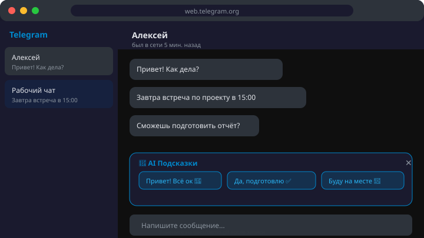

<p align="center">
  
</p>

<h1 align="center">Telegram AI Assistant</h1>

<p align="center">
  <strong>AI-подсказки по ответам прямо в web.telegram.org</strong><br/>
  Chrome Extension (Manifest V3) · TypeScript · OpenAI / Anthropic / Ollama
</p>

<p align="center">
  <a href="#установка">Установка</a> •
  <a href="#возможности">Возможности</a> •
  <a href="#провайдеры">Провайдеры</a> •
  <a href="#настройка">Настройка</a> •
  <a href="#разработка">Разработка</a> •
  <a href="#лицензия">Лицензия</a>
</p>

---

<!-- GIF-демо: замените docs/demo-placeholder.svg на docs/demo.gif после записи экрана -->
<!-- Инструкция по записи: docs/RECORDING.md -->
<p align="center">
  
</p>

## Что это?

**Telegram AI Assistant** — Chrome-расширение, которое встраивается в [web.telegram.org](https://web.telegram.org) и генерирует умные AI-подсказки по ответам в чатах. Расширение читает контекст переписки (последние сообщения, тип чата, язык) и предлагает 2–3 варианта ответа — от краткого до развёрнутого.

> **Данные чата не покидают ваше устройство**, кроме запроса к выбранному AI-провайдеру.

## Возможности

| Фича | Описание |
|---|---|
| 🤖 **AI-подсказки** | 2–3 варианта ответа, адаптированных под тон чата |
| ⚡ **Быстрая вставка** | Клик по подсказке → текст в поле ввода |
| 🎨 **Адаптивная тема** | Автоматически подстраивается под светлую / тёмную тему Telegram |
| ⌨️ **Горячие клавиши** | `Alt+1` / `Alt+2` / `Alt+3` — мгновенный выбор подсказки |
| 🔄 **Автотриггер** | Генерация подсказок при новом входящем сообщении (опционально) |
| 🌍 **Мультиязычность** | Автоопределение языка переписки |
| 🔒 **Приватность** | Минимальные permissions, опциональная анонимизация имён |
| 🛠 **Гибкие провайдеры** | OpenAI, Anthropic, Ollama, любой OpenAI-совместимый API |

## Установка

### Из Chrome Web Store

> 🚧 В процессе публикации — следите за обновлениями.

### Ручная установка (для разработчиков)

```bash
git clone https://github.com/<owner>/telegram-ai-assistant.git
cd telegram-ai-assistant
npm install
npm run build
```

1. Откройте `chrome://extensions/`
2. Включите **Режим разработчика** (переключатель в правом верхнем углу)
3. Нажмите **Загрузить распакованное расширение**
4. Выберите папку `dist/`

## Провайдеры

| Провайдер | Модели | Примечание |
|---|---|---|
| **OpenAI** | GPT-4o-mini, GPT-4o | Требуется API-ключ |
| **Anthropic** | Claude 3.5 Sonnet, Claude 3 Opus | Требуется API-ключ |
| **Ollama** | Любая модель (llama3, mistral, …) | Локально, бесплатно |
| **Custom** | Любой OpenAI-compatible endpoint | Свой URL + ключ |

## Настройка

### Быстрый старт

1. Установите расширение
2. Нажмите на иконку 🤖 в панели расширений
3. Перейдите в **Настройки** (Options)
4. Выберите провайдера и введите API-ключ
5. Откройте [web.telegram.org](https://web.telegram.org) — готово!

### Options page

- **Провайдер** — OpenAI / Anthropic / Ollama / Custom
- **API Key** — ключ для облачного провайдера
- **Модель** — название модели (напр. `gpt-4o-mini`)
- **Base URL** — для Ollama / Custom (напр. `http://localhost:11434`)
- **System Prompt** — свои инструкции для AI (тон, стиль, формат)
- **Кол-во подсказок** — от 1 до 5

### Popup

- Toggle вкл/выкл расширения
- Статус подключения
- Быстрый доступ к настройкам

## Как это работает

```
┌────────────────────────────────────────────────────────────┐
│  web.telegram.org                                          │
│  ┌──────────────────────────────────────────────────────┐  │
│  │  Чат                                                 │  │
│  │  ┌───────────────────────────────────┐               │  │
│  │  │ Собеседник: Привет! Как дела?     │               │  │
│  │  │ Собеседник: Завтра встреча в 15:00│               │  │
│  │  └───────────────────────────────────┘               │  │
│  │                                                      │  │
│  │  ┌─────────────────────────────────────────────────┐ │  │
│  │  │ 🤖 AI Подсказки                              ✕ │ │  │
│  │  │ ┌─────────────┐┌──────────────┐┌─────────────┐ │ │  │
│  │  │ │ Привет! Всё ││ Хорошо, буду ││ Отлично!    │ │ │  │
│  │  │ │ супер 👋    ││ на месте ✅  ││ Подтвержд...│ │ │  │
│  │  │ └─────────────┘└──────────────┘└─────────────┘ │ │  │
│  │  └─────────────────────────────────────────────────┘ │  │
│  │  ┌──────────────────────────────────────────┐        │  │
│  │  │ Напишите сообщение...                    │        │  │
│  │  └──────────────────────────────────────────┘        │  │
│  └──────────────────────────────────────────────────────┘  │
└────────────────────────────────────────────────────────────┘
```

1. **Content Script** парсит последние сообщения из DOM web.telegram.org
2. Контекст отправляется в **Background Service Worker**
3. Service Worker вызывает выбранный **AI-провайдер** (OpenAI / Anthropic / Ollama)
4. Варианты ответов показываются как **кликабельные чипсы** над полем ввода
5. Клик → текст вставляется в поле ввода Telegram

## Разработка

### Требования

- Node.js ≥ 18
- npm ≥ 9

### Команды

```bash
npm install          # Установка зависимостей
npm run dev          # Dev-сервер с HMR
npm run build        # Production build → dist/
npm run typecheck    # Проверка типов (tsc --noEmit)
npm run lint         # ESLint
npm run lint:fix     # ESLint с автоисправлением
npm run format       # Prettier — форматирование
npm run format:check # Prettier — проверка
```

### Структура проекта

```
src/
├── manifest.json          # Chrome Extension Manifest V3
├── background/            # Service Worker — AI API, настройки
│   └── index.ts
├── content/               # Content Script — DOM Telegram, UI
│   ├── index.ts
│   └── styles.css
├── popup/                 # Popup — быстрые настройки
│   ├── index.html
│   └── popup.ts
├── options/               # Options — провайдер, ключ, модель
│   ├── index.html
│   └── options.ts
├── lib/                   # Общие модули
│   ├── providers/         # AI провайдеры
│   ├── telegram/          # DOM парсинг Telegram
│   └── types.ts           # TypeScript типы
└── assets/                # Иконки (16/32/48/128)
```

### Архитектура

```
Content Script ←→ chrome.runtime.sendMessage ←→ Background SW
     │                                              │
     ├── DOM parsing (MutationObserver)              ├── AI Provider API call
     ├── UI injection (suggestion chips)             ├── Settings management
     └── Insert text on click                        └── Rate limiting
```

## Безопасность

- **Минимальные permissions**: только `storage` и `activeTab`
- **Host permissions**: только `https://web.telegram.org/*`
- **Нет remote code**: весь код бандлится локально
- **API-ключи**: хранятся в `chrome.storage.local` (зашифрованы)
- **Анонимизация**: опция замены имён в сообщениях перед отправкой в AI
- **CSP**: строгая Content Security Policy

## Roadmap

- [x] Scaffold — MV3, TypeScript, Vite
- [x] Content Script + Background SW + Popup + Options
- [x] Иконки расширения
- [ ] DOM парсинг web.telegram.org
- [ ] AI-провайдеры (OpenAI, Anthropic, Ollama)
- [ ] UI подсказок с адаптивной темой
- [ ] Горячие клавиши
- [ ] Chrome Web Store публикация

## Лицензия

MIT © 2026

---

<p align="center">
  <sub>Сделано с ❤️ для продуктивного общения в Telegram</sub>
</p>
